# Заметки по книге [Web Performance in Action](https://www.dropbox.com/s/rjt175gbuhc705x/Wagner%20J.%20-%20Web%20Performance%20in%20Action.%20Building%20Faster%20Web%20Pages%20-%202016.PDF?dl=0) и не только


## Глава 1 (Understanding web performance)

### 1.1.2 How web browsers talk to web servers 
Первое что нужно сделать, чтобы повысить производительность сайта, это снизить задержки (`latency`) при общении с сервером.  

При использовании протокола `HTTP/1` возникает феномен, называемый Блокировка начала строки (`head-of-line blocking`). 
Это происходит потому, что браузер ограничивает количество запросов, которые он будет делать за один раз (обычно шесть).
Такое поведение увеличивает время загрузки страницы.  

Далее в главе немного о `Chrome Dev Tools` (ничего нового).  
Вес страницы для устройств с ретиной больше чем на устройствах со стандартной плотностью отображения.  

### 1.4 Optimizing the client’s website
При улучшении производительности веб-сайта цель проста: уменьшить объем переданных данных (эта простая концепция работает как для `HTTP/1`, так и для `HTTP/2`). Надо начать с минимизации ресурсов сайта, включая CSS, JavaScript и HTML-код, картинки  

### 1.4.1 Minifying assets 
`npm i -g minifier html-minify` - пакеты для минификации ресурсов  
`minify -o ./css/styles.min.css ./css/styles.css` - минификация css  
`minify -o jquery.min.js jquery.js` - минификация js  
`htmlminify -o index.html index.src.html` - минификация html  

### 1.4.2 Using server compression
Сжатие на сервере работает следующим образом: пользователь запрашивает веб-страницу с сервера, запрос пользователя сопровождается `Accept-Encodingheader`, который сообщает серверу форматы сжатия, которые браузер может использовать. Метод сжатия, называемый `gzip` имеет почти универсальную поддержку браузеров, и очень эффективен в уменьшении размера текстовых ресурсов.  

Проделала практику из книги, сразу заметно уменьшение веса `css(16KB -> 3.1KB)` и `js(84.4KB -> 30KB, 2KB -> 1.1KB)` файлов.

### 1.4.3 Optimizing images 
Пробовала ресурс [tinypng.com](http://tinypng.com) - жмет хорошо, потери качетва на jpg практически незаметны, на png-шках области с тенями/полупрозрачные видно как шакалятся, для примера собрала несколько изображений в папку [/optimazeImage](https://github.com/AnastasiyaDev/optimization-notes/tree/master/images/optimazeImage)  

Слева направо: оригинальная картинка, оптимизация с помощью `ImageOptim`, оптимизация с помощью `tinypng.com`  

<table cellpadding="0" cellspacing="0" width="100%">
	<tr>
		<td width="280px" align="center">
			
			<span>оригинал - 127КБ</span>
		</td>
		<td width="280px" align="center">
			
			<span>ImageOptim - 120КБ</span>
		</td>
		<td width="280px" align="center">
			
			<span>TINYPNG - 30КБ</span>
		</td>
	</tr>
</table>

### 1.6 Summary
* Анализ веса страницы с помощью `Developer Tools` в Google Chrome
* Минификация текстовых ресурсов, которая удаляет ненужные пробелы из файлов, не затрагивая их функции
* Дальнейшее сокращение размера этих текстовых ресурсов с помощью сжатия на стороне сервера
* Оптимизация изображений

Наибольший прирост к скорости загрузки был после оптимизации изображений - **30%** на тестовой странице, против **10%** у сжатия css, js и **14%** после использования сжатия на сервере


## Глава 2 (Using assessment tools)
inline-CSS (вставленый через `<style>`) позволяет загружать стили одновременно с HTML, сокращает HTTP-запросы, что хорошо для серверов с `HTTP/1`, увеличивает скорость рендеринга документа, но не кэшируется  

`Google Analytic`  

### 2.3.1 Viewing timing information  
Можно почитать об этом в [документации от гугл](https://developers.google.com/web/tools/chrome-devtools/network-performance/reference#timing-explanation)  

`Time to First Byte(TTFB)` - количество времени между моментом, когда пользователь запрашивает веб-страницу и 
моментом поступления первого байта ответа  

`Developer Tools` - чтобы устранинить задержку браузер создает `DNS lookup cache`  

### 2.3.2 Viewing HTTP request and response headers
`Content-Encoding` - в этом заголовке указывается, сжат ли ресурс веб-сервером.  

### 2.4.1 Understanding how browsers render web pages 
<table cellpadding="0" cellspacing="0" width="100%">
  <tr>
    <td width="600px">
      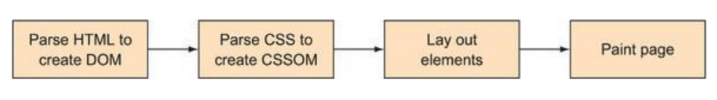
    </td>
  </tr>
</table>

Этапы рендеринга страницы:  
1. `HTML` загружается с сервера и парсится браузером для построения `DOM`.  
2. После того, как `DOM` построен браузер распарсивает `CSS` и создает `CSSOM`. Это похоже на `DOM`, за исключением того, что он описывает способ применения CSS-правил к документу.  
3. `DOM` и `CSSOM` объединяются для создания дерева рендеринга. Затем дерево рендеринга проходит процесс расположения/планировки (`layout process`), где применяются CSS-правила и элементы размещаются на странице.  
4. Применение стилей, отрисовка в пикселях (растрирование) и отображение. 

Еще одна схемка рендеринга(презентация [Лечим непроизводительные анимации](https://www.youtube.com/watch?v=hsKh-AuFBDI))

<table cellpadding="0" cellspacing="0" width="100%">
  <tr>
    <td width="500px">
      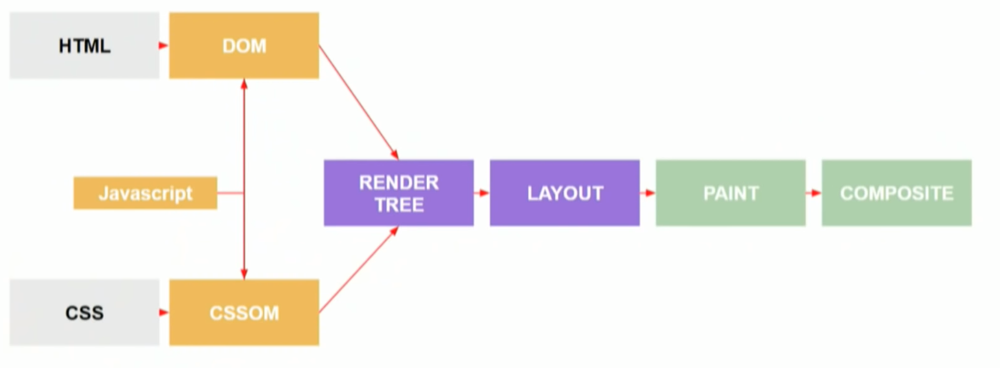
    </td>
  </tr>
</table>

* **Rendering Tree** — браузер "склеивает" DOM, CSSOM и JS, браузер уже понимает как будет выглядить сайт. Оно похоже на дерево DOM с некоторыми отличиями. В нем могут быть псевдоэлементы, которых нет в дереве DOM. Здесь также отсутствуют некоторые узлы из DOM: секция head, тэги link, script, элементы с display: none — все, что нам не надо показывать.
* **Layout** — выщитывает размеры блоков и их расположение
* **Paint** — растеризация сайта, его раскраска
* **Сomposite** — браузер сам решает какие части сайта вынести на отдельные слои, обрабатывается GPU или CPU

Растеризация: перевод изображения из вектора в конечную сетку пикселей, которую браузер покажет пользователю.
 
Слой — это часть страницы, поддерево DOM. Он отрисовывается независимо и компонуется в GPU. Он может растягиваться, перемещаться, скрываться (через прозрачность) без отрисовки. Существуют условия, встречая которые браузер выносит элемент в новый композитный слой:
* Элементы с 3D-трансформацией (translateZ hack - `transform: translateZ(0);`)
* `<video>` с с включенным аппаратным ускорением
* `<canvas>` с 3D (или 2D с включенным аппаратным ускорением)
* Плагины (flash, silverlight)
* CSS анимации opacity/transform
* CSS фильтры
* Элементы, вынесенные над композитным слоем (т.е. `z-index`)


Какие этапы проходит каждый кадр(но некоторые для некоторых св-в пропущены, см. [csstriggers](https://csstriggers.com) - показывает какие этапы рендеринга проходит то, или оное css-свойство):

<table cellpadding="0" cellspacing="0" width="100%">
  <tr>
    <td width="500px">
      
    </td>
  </tr>
</table>

* **JavaScrict** (сюда входит и css и webAnimationAPI) - сортировка DOM, добавление новых узлов, чем меньше дом-узлов, тем быстрее проходит этот этап
* **Style** — вычисление стилей, dom events(добавление/удаление классов)
* **Layout** — пересчет размеров блоков(width/height/padding/margin), на этом этапе обычно происходит мерцание, классическая ошибка - Best Practices###6
* **Paint** — растирезация сайта(трудоемкий этап, плохо когда большая картинка вставляется в блок намного меньшего размераю, img), покраска(color, background-color, border-color, box-shadow)
* **Компановка**

Лучшее свойства для рендеринга: `transform`, `opacity` и `filter` (пропускают этапы **Layout** и **Paint**) - обработаны напрямую через GPU.

Изменения на страницы приводят к повторному рендерингу.  

### 2.4.2 Using Google Chrome’s Timeline tool (Performance)
Инструмент фиксирует четыре конкретных типа событий, каждый из которых имеет цветную кодировку:

* Loading (Blue)—Network-related events such as HTTP requests. It also includes activity such as the parsing of HTML, CSS, and image decoding.  
* Scripting (Yellow)—JavaScript-related events. These can range from DOM-specific activity, to garbage collection, to site-specific JavaScript, and to other activity.  
* Rendering (Purple)—Any and all events relating to page rendering. Events in this category are activities such as applying CSS to the page HTML, and events that cause re-rendering such as changes to the page’s HTML triggered by JavaScript.  
* Painting (Green)—Events related to drawing the layout to the screen, such as layer compositing and rasterization.  
* Other activity - состоит из активности процессора, которую Chrome не может сломать(?) и представить на диаграмме.  

Продолжила изучать [здесь](https://developers.google.com/web/tools/chrome-devtools/evaluate-performance/), в книге не совсем актуальные данные, сложнее сопоставлять

1. Первая диаграма **FPS** - чем выше зеленые полосы, тем вышеше *FPS*, красная линия - просидания.  
2. Цвета в диаграмме **CPU** соответствуют цветам на вкладке `Summary`. Если диаграмма **CPU** полона цветом, значит, что CPU был перегружен во время записи.  
3. Раздел **Frames** - выбор зеленого квадрата, показывает количество **FPS**.  
4. Раздел **Main** -  Каждый бар представляет собой событие. Более широкий бар означает, что событие заняло больше времени. Ось-y представляет стек вызовов. Когда вы видите события, укладываются друг на друга. При выборе события на шкале времени, если у него есть красный треугольник в верхнем левом углу, то это плохо. Клик на событие -> внизу в `Summary` -> `reveal` -> 
событие, инициировавшее текущие событие -> `Details` (ссылка на строку кода)

### 2.4.3 Identifying problem events: thy enemy is jank
**Jank-эффект** - взаимодействия и анимации, которые подтормаживают или не выглядят плавно. Причина слишком много процессорного времени потребляется в течение одного кадра (фрейма). [Игра](http://jakearchibald.github.io/jank-invaders)

### 2.4.4 Marking points in the timeline with JavaScript
Можно поставить через JS сво метку, которая по событию появиться на таймлайне в панеле Network. 

```
console.timeStamp('Modal open');
```
### 2.5 Benchmarking JavaScript in Chrome
```
1.console.time("jQuery"); jQuery("#schedule"); console.timeEnd("jQuery");  - 0.323ms
2.console.time("querySelector"); document.querySelector("#schedule"); console .timeEnd("querySelector"); - 0.069ms
```


## Глава 3 (Optimizing CSS)
* DRY (don’t repeat yourself).  
* Писать сокращенными правилами (`padding, margin, font`)  
* Не усложнять селекторы, чем вложенность меньше, тем лучше, в идеале <= 3.  
* Грузить только те стили, которые нужны на конкретной странице.  
* Стараться не использовать `@import` в CSS (не в предпроцессарах, а именно в CSS). `@import` делает запросы последовательно, а `<link>` - параллельно.  
*  `<link>` должны быть в `<head> `.  
* **CSS transition** быстрее, чем **Query animate()**.  
* Использовать `will-change`, но аккуратно, выносит анимацию на отдельный слой, нужно делать только для крупной, значимой, заметной анимации.

Скорость суммы процессов рендеринга и отрисовки в зависимости от выбора css-селектора:  

<table cellpadding="0" cellspacing="0" width="100%">
  <tr>
    <td width="500px">
      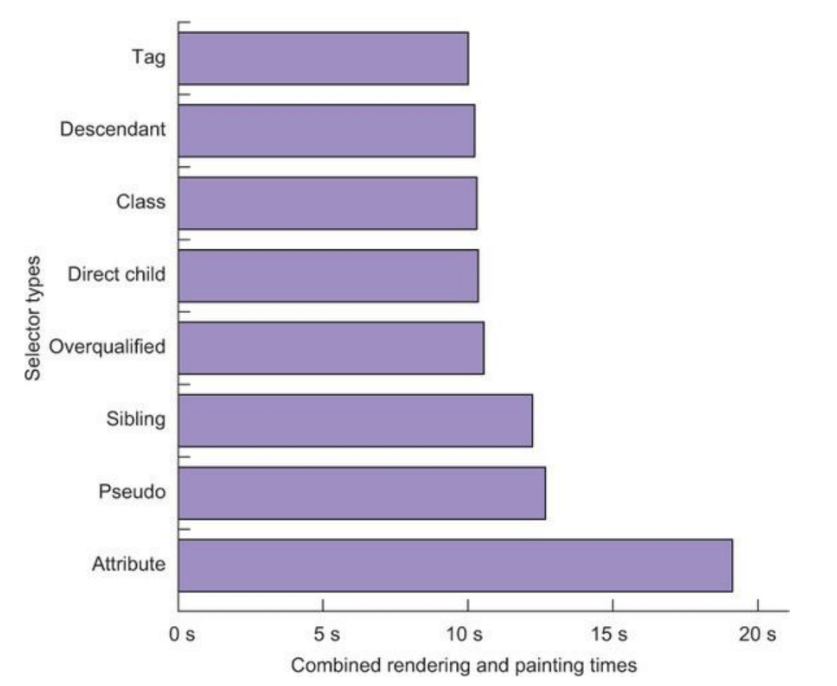
    </td>
  </tr>
</table>


## Глава 4 (Understanding critical CSS)
`<style>` в `<head>` и в нем все стили касающиеся первого видимого окна, они не кешируются, зато быстро отрисовываются, сокращается время до **First Paint** (см. пункт Инструменты, Прогрессивные веб-метрики)

### 4.2.2 Loading below-the-fold styles 
Использование нового стандарта `<link rel="preload">` - [статья на русском](http://prgssr.ru/development/dlya-chego-stoit-ispolzovat-predzagruzku.html), [браузерная поддержка](https://caniuse.com/#search=preload)


## Глава 5 (Making images responsive)
Время отрисовки на четверть меньше для не масштабируемых избражений (т.е. не грузить картинки шириной больше, чем размер экрана устройства), а время рендеринга ~на восьмую часть

### 5.2.3 Knowing what image formats to use 
Есть формат WebP от гугла, релиз 2010 года, формат интересный и полезный для более эффетивного сжатия для избражений с прозрачностью, но [поддержка](https://caniuse.com/#feat=webp) плоха до сих пор. [Онлайн-конвектор](https://pastebin.com/QNKmkfKz)

### 5.3.2 Targeting high DPI displays with media queries 
```
@media screen (-webkit-min-device-pixel-ratio: 2), (min-resolution:  192dpi) {/*  Put  High  DPI  Styles  Here  */} 
@media screen (-webkit-min-device-pixel-ratio: 2), (min-resolution:  192dpi), and (min-width:  105em) {}
```
### 5.4.1 The universal max-width rule for images  
```
img {
    max-width: 100%;
}
```

### 5.4.2 Using srcset 
Не респонсивный вариант, при изменении ширины экрана загружает картинки только при увеличении разрешения, при уменьшении ничего не происходит, грузит первую большую картинку и дальше резайзит ее. 

```

```
Добавление атрибута `sizes` дает больше возможностей, при ширине 704px картинка занимает половину ширины экрана - 50vw, при 480px - 75vw ширины и подефолту - 100vw

```

```
### 5.4.3 Using the `<picture>` element  
Для больших экранов браузер сам выберет какую картинку ему подтянуть, для маленьких кранов он будет выбирать картинку в соответствии с DPI (1x или 2x): 
```
<picture>
    <source media="(min-width: 704px)"
            srcset="img/amp-medium.jpg 384w,
		    img/amp-large.jpg 512w"
	    sizes="33.3vw">
    <source srcset="img/amp-cropped-small.jpg 1x,
		    img/amp-cropped-medium.jpg 2x"
	    sizes="75vw">
    
</picture>
```

У `<picture>` есть еще атрибут `type`, позволяющий использовать изображения форматов, которые плохо поддерживаются, например **webp**:
```
<picture>
    <source srcset="img/amp-small.webp" type="image/webp">
    
</picture>
```
	
### 5.4.4 Polyfilling support with Picturefill
Не забыть добавить элемент `<picture>` для браузеров, которые его не поддерживают, а затем подключить полифилл

```
<script>document.createElement("picture");</script>
<script src="js/picturefill.min.js" async></script>
``` 


# Глава 6 (Going further with images)

### 6.1 Using  image  sprites 
Использовать спрайты по HTTP/1 - хорошо, по HTTP/2 - плохо

### 6.1 Reducing  raster  images  with  imagemin 
TODO @me
- [ ] Попробовать вместо `picture` использовать `img` ниже
 
```

```

Есть сборка: установка пары npm-пакетов и запуск скрипта с помощью ноды, а так же вывод (с графиком!), о том, что пожатые картинки (на 59% jpg и на 35% png) грузятся в 2 раза быстрее.

### 6.2.2 Optimizing SVG images
```
npm i -g svgo
svgo -o logo-opt.svg logo.svg
svgo -h 	- посмотреть опции оптимизации
svgo -p 1 -o logo-opt-1.svg logo.svg  - больший процент сжатия, но надо следить чтобы изображение не попячилось (планые линии становятся угловатыми)
```

### 6.2.2 Encoding lossy WebP images with imagemin
```
npm i imagemin imagemin-webp
```
Сравнение в скорости загрузки для неоптимизированных **JPG**, оптимизированных **JPG** и **WebP** для различных DPI:  

<table cellpadding="0" cellspacing="0" width="100%">
  <tr>
    <td width="500px">
      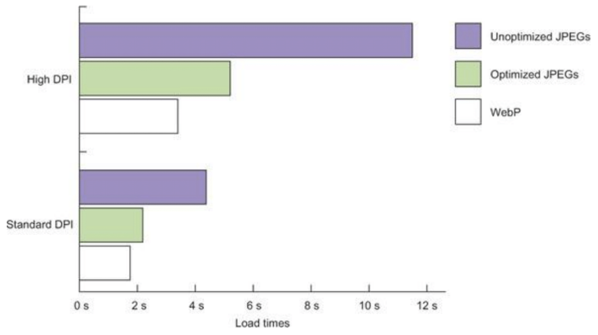
    </td>
  </tr>
</table>

Сравнение в скорости загрузки для неоптимизированных **PNG**, оптимизированных без потерь **PNG** и **WebP** для различных DPI: 

<table cellpadding="0" cellspacing="0" width="100%">
  <tr>
    <td width="500px">
      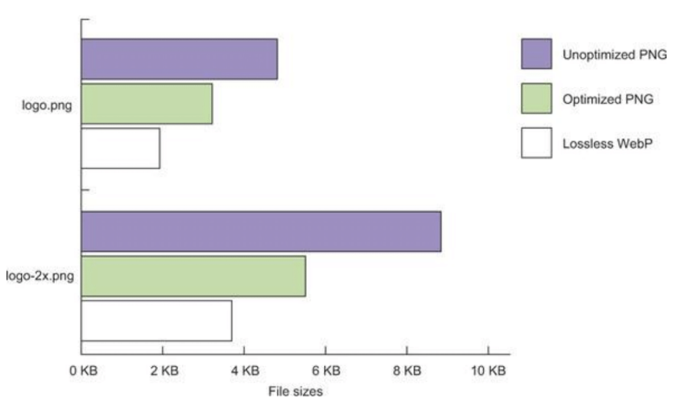
    </td>
  </tr>
</table>

+ WebP сжимается лучше, чем jpg и png форматы


# Глава 7 (Faster fonts)
### 7.1.2 Rolling your own @font-face cascade 

**Converting fonts**

| Font format | Extension | Browser support |
| ------------|:---------:|-----------------|
|TrueType     |ttf        | Все, кроме IE8- |
|OpenType     |eot        | IE6+ 	    |
|WOFF 	      |woff       | Все, кроме Android Browser 4.3-  и IE8-|
|WOFF2        |woff2      | Все современные, кроме IE и плохо в Safari|

Плагины для конвертации:
```
npm install -g ttf2eot ttf2woff ttf2woff2

ttf2eot OpenSans-Light.ttf OpenSans-Light.eot
ttf2woff OpenSans-Light.ttf OpenSans-Light.woff
cat OpenSans-Light.ttf | ttf2woff2 >> OpenSans-Light.woff2
```

**Building the @font-face cascade**
Пишем правила для каждого веса шрифта (`font-weight`) и стиля (`font-style`) начиная с самого легкого, пример одного правила:
```
@font-face {
	font-family: "Open Sans Light";
	font-weight: 300;
	font-style: normal;
	src: local("Open Sans Extra Light"),
	     local("OpenSans-Light"),
	     url("open-sans/OpenSans-Light.woff2") format("woff2"),
	     url("open-sans/OpenSans-Light.woff") format("woff"),
	     url("open-sans/OpenSans-Light.eot") format("embedded-opentype"),
	     url("open-sans/OpenSans-Light.ttf") format("truetype");
}
```

* `local("Open Sans Extra Light"),local("OpenSans-Light"),` - ищет шрифты в системе, прежде чем качать их, для тестирования надо комментировать эти строки, иначе он подтянет шрифты из системы и не будет видна возможна загрузка . 
* `url(...` - дальше браузер проходит по списку подключенных шрифтов сверху вниз и подключает доступный шрифт, список надо начинать надо с наиболее приоритетного . 

Использование выше описанного шрифта:
```
font-family: "Open Sans Light", Helvetica, Arial, sans-serif;
font-weight: 300; // - использовать тот же, что есть в описании @font-face
```

### 7.2 Compressing EOT and TTF font formats
Форматы `WOFF2` и `WOFF` внутренне сжаты, `TTF` и `EOT` - не сжаты, но сжатие возможно настроить на стороне сервера 

TODO @me
- [ ] Узнать про сжатие шрифтов на сервере у нас

### 7.3 Subsetting fonts
Надо скачивать только те алфавиты в шрифтах, которые используются, ресурсы типа **Google Fonts** и **Adobe Typekit** позволяют это сделать, можно для этого использовать библиотечку для выделения только нужного диапозона Unicode-символов, пример:

```
pyftsubset  OpenSans-Regular.ttf --unicodes=U+0000-007F  --output-file=OpenSans-Regular-BasicLatin.ttf --name-IDs='*'
```

### 7.4.1 Understanding font-loading problems 
* **FOIT (Flash of Invisible Text)** — «мелькание невидимого текста», когда во время загрузки веб-шрифта текст не отображается, изначально загружается невидемый щрифт;
* **FOUT (Flash of Unstyled Text)** — «мелькание неоформленного текста», когда во время загрузки веб-шрифта текст отображается шрифтом по умолчанию (напр. системным);

У разных браузеров различное поведение при загрузке шрифта:
* Chrome и Firefox ждут 3 секунды перед тем, как отобразить текст запасным шрифтом. В дальнейшем, когда шрифт загрузится элементы использующие этот шрифт перерисуются с новым шрифтом. Возможно вы замечали как некоторые страницы “мерцали” при смене шрифта.
* Internet Explorer не ждет трех секунд, а сразу отрисовывает текст: если браузер еще не загрузил шрифт, то используется запасной. После загрузки шрифта элементы перерисуются.
* В Safari нет времени ожидания.

### 7.4.2 Using the CSS font-display property
Свойство [font-display](https://caniuse.com/#search=font-display) определяет как шрифт отобразится, в зависимости от того, когда шрифт загрузят. Нужно добавить вконец объявления `@font-face{}`. Имеет значения:
* `auto`
Использует поведение браузера по умолчанию. Обычно это поведение ‘block’.
* `block`
Устанавливает короткий период блокировки (3 секунды) и бесконечный период замены.
Если шрифт не загрузился, то браузер отрисовывает невидимый текст, но после загрузки заменяет его как можно раньше. Это поведение не подходит для иконочных шрифтов, ведь если шрифт не загрузится и пройдет 3 секунды, то пользователь увидит квадраты вместо иконок.

* `swap`
Устанавливает период блокировки в 0 секунд и бесконечный период замены.
Браузер сразу отрисовывает текст безопасным шрифтом и пользователь не видит пустого экрана дожидаясь загрузки шрифта. Но когда шрифт загрузится, он сразу заменится.

* `fallback`
Устанавливает очень короткий период блокировки (100 мс или меньше) и короткий период замены (3 секунды).
Работает так-же как и swap, но если шрифт не загрузился в течении 3-х секунд, то браузер отрисует текст запасным шрифтом. Подходит для текста предназначенного для вдумчивого чтения. В таком случае шрифт играет второстепенную роль. Если он быстро не загрузился, то не стоит отвлекать пользователя мерцанием от замены шрифта.

* `optional`
Устанавливает очень короткий период блокировки (100 мс или меньше) и период замены в 0 секунды.
Похоже на ‘fallback’, но по истечению 3-х секунд, браузер может или прервать загрузку (при медленном интернете) или понизить приоритет загрузки. Когда браузер загрузит шрифт, он все равно продолжит отображать текст запасным шрифтом, но если вы обновите текущую или перейдете на другую страницу, для которой установлено значение ‘optional’ и используется тот-же шрифт, то браузер отрисует текст загруженным шрифтом.

Советуют ставить по умолчанию `font-display: swap`.

### 7.4.3 Using the font-loading API 
Если используются сторонние поставщики шрифтов на ваш сайт, то у вас нет возможности контроливать cssи следовательно сделать так, как описано выше, но можно это сделать с помощью **font-loading API** через js.

В чем суть этого подхода:
1. В файле со стилями, после объявления шрифтов, надо указать семейство шрифтов для конкретного селектора в области класса `
.fonts-loaded`
```
.fonts-loaded body{
	font-family: "Open Sans Regular";
}
```
2. В `<head>` после тега `<link>`, который импортирует `styles.css` (который импортирует наши шрифты), вставить `<script>` с содержанием
```
		<script>
			(function(document){
				if(document.fonts && document.cookie.indexOf("fonts-loaded") === -1){
					document.fonts.load("1em Open Sans Light");
					document.fonts.load("1em Open Sans Regular");
					document.fonts.load("1em Open Sans Bold");
					document.fonts.ready.then(function(fontFaceSet){
						document.documentElement.className += " fonts-loaded";
						document.cookie = "fonts-loaded=";
					});
				}
				else{
					document.documentElement.className += " fonts-loaded";
				}
			})(document);
		</script>
```

Один из недостатков этого метода заключается в том, что он вызывает перерисовку текстовых элементов на странице, но повышенная доступность стоит того, чтобы его использовать. - пишут в книге
Я вижу кучу лишнего кода, по сравнению с 1й строчкой в css, тем более, что поддержка сейчас у `font-display` хорошая и не видела не разу чтобы такой метод использовался. Ктоме того нет поддержки в IE и Edge, но в книге на этот случай описан полифилл **Font  Face  Observer **.


# Глава 8 (Keeping JavaScript lean and fast)
### 8.1.1 Placing  the  `<script>`  element  properly
Браузеры читают HTML-документы сверху вниз. Когда ссылки на внешние ресурсы найдены, браузер перестает парсить html, а загружает и анализирует ресурсы, рендеринг блокируется. Поэтому надо грузить скрипты внизу страницы, иначе отрисовка будет отложенной.

### 8.1.2 Working with asynchronous script loading
`async` используется для того, чтобы указать браузеру, что скрипт может быть выполнен асинхронно.
Парсеру HTML нет необходимости останавливаться, когда он достигает тега `<script>` для загрузки и выполнении. Выполнение может произойти после того, как скрипт будет получен параллельно с разбором документа.

Атрибут `defer` указывает браузеру, что скрипт должен быть выполнен после того, как HTML-документ будет полностью разобран. Как и при асинхронной загрузке скриптов — файл может быть загружен, в то время как HTML-документ парсится. Однако, даже если файл скрипта будет полностью загружен ещё до того, как парсер закончит работу, он не будет выполнен до тех пор, пока парсер не отработает до конца.

Если внешний JavaScript-файл размещается непосредственно перед закрывающим тегом `</body>`, то использование `async` и `defer` становится менее уместным, так как парсер к тому времени уже разберёт большую часть документа, и JavaScript-файлы уже не будут оказывать воздействие на него.

### 8.1.4 Using async reliably with multiple scripts
Организация скриптов для загрузки асинхронно, сохраняя зависимости (деление на независимые модули): 
* ***AMD*** – одна из самых древних систем организации модулей, требует лишь наличия клиентской библиотеки, к примеру, require.js, но поддерживается и серверными средствами.
* ***CommonJS*** – система модулей, встроенная в сервер Node.JS. Требует поддержки на клиентской и серверной стороне.
* ***UMD*** – система модулей, которая предложена в качестве универсальной. UMD-модули будут работать и в системе AMD и в CommonJS.

### 8.2 Using leaner jQuery-compatible alternatives
Вряд ли это актуально для нас, на мадженто2 используется jquery и куча виджетов основоных на ней. Сам файл **jquery.min.js** на М2 весит **94.9 KB**.

Тем не менее, альтернативы предложенные в книге (у все вес меньше 10KB):

* [Zepto](http://zeptojs.com) - самая функциональная, расщиряемая и популярная альтернатива jQuery.  

* [Shoestring](https://github.com/filamentgroup/shoestring)  

* [Sprint](https://github.com/bendc/sprint)

### 8.2.4 Comparing performance
Библиотека [бенчмарков для js-кода](https://benchmarkjs.com) - можно сравнивать по произвобительности куски кода. **Sprint** по этим данным из 4х библиотек справился быстрее всех по выбору элемента по классу, тогглу класса, тогглу атрибута, быстрее jquery раза в 3.

### 8.3 Getting by without jQuery 
Благодаря стандортизации javascript его можно использовать нативно, без библиотек-надстроек. В разделе идут примеры использования чистого js.

### 8.3.5 Making AJAX requests with the Fetch API
Раньше в js использовался объект `XMLHttpRequestrequest`. Это был громоздкий способ делать запросы AJAX, а разные браузеры требовали разных подходов. jQuery реализовал AJAX - обертку над объектов XMLHttpRequest, которая гараздо удобнее в использовании. Но некоторые браузеры реализовали собственный API-интерфейс, который называется Fetch API.

### 8.3.6 Using the Fetch API
Наиболее часто используют `fetch` для GET-запросов 

```
fetch("https://api.moviemaniac.com/movies/the-burbs")
    .then(function(response){
        return response.json();
    }).then(function(data){
        console.log(data);
    });
```

Так эе возможно использование POST-запросов и передача параметров в `fetch`.

### 8.3.7 Polyfilling the Fetch API
Ну конечно не все браузеры это поддерживают(EI) и в этом разделе описываются варианты как это завести в таких вот браузерах. 

### 8.4 Animating with requestAnimationFrame
Раньше для анимации через js использовались `setTimeout` и `setInterval` - оно вроде ок, но не оптимально. Использование `requestAnimationFrame`([поддержка](https://caniuse.com/#search=requestAnimationFrame)) позволяет синхронизировать наши анимации со встроенными механизмами обновления страницы - [статья на learn.javascript](https://learn.javascript.ru/js-animation#requestanimationframe). В плане производительности `requestAnimationFrame` уступает только в процессе скриптинга, но в процессах рендеринга и отрисовки он работает быстрее, чем CCS `transition` и `setTimeout`. 

Т.к. использование `requestAnimationFrame` очень громоздкое, авторы предлагают jQuery независимую библиотеку для анимации [Velocity.js](http://velocityjs.org), но если jQuery все же подключен в проект, то это библиотеку можно использовать вместе с ним (хотя зачем если тогда будет доступен точно такой же по синтаксису удобный метод `animate()`). 


# Глава 9 (Boosting performance with service workers)
### 9.1 What are service workers?
Offline-режим, периодическая фоновая синхронизация, push-уведомления — этот функционал нативных приложений уверенно приходит в web. Service Worker’ы предоставляют для этого техническую возможность. ([статья](https://getinstance.info/articles/javascript/introduction-to-service-workers/))
	
**Service Worker** — это скрипт, который браузер запускает в фоновом режиме, они выполняют такие функции как push-уведомления и фоновая синхронизация, возможность перехватывать и обрабатывать сетевые запросы, включая программное управление кешированием ответов.

Поскольку Service Worker работают с отдельным потоком, они ведут себя иначе, чем JavaScript, загруженный с помощью тега <script>. Service workers не может получить доступ к DOM напрямую. Вместо этого, Service Worker может обмениваться данными со страницами, которые он контролирует, реагируя на сообщения, отправленные через интерфейс postMessage API, и эти страницы могут манипулировать DOM, если это необходимо.
	
Service worker осуществляют связь в качестве прокси-сервера между пользователем и веб-сервером. Пользователь делает запросы, которые Service Worker может перехватить. В зависимости от того, как написан код службы Service Worker, активы могут быть извлечены из кеша CacheStorage service workers или переданы на веб-сервер. Service workers может также записывать кеш в определенных случаях.

<table cellpadding="0" cellspacing="0" width="100%">
  <tr>
    <td width="501px">
      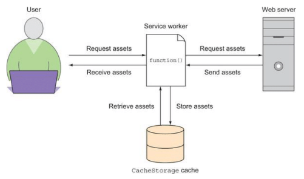
    </td>
  </tr>
</table>

### 9.2. Writing your first service worker
Зарегистрировать Service Worker можно только на странице поверх HTTPS. Для удобства Service Worker могут работать на localhost без HTTPS, но из-за уровня доступа, который Service Worker имеют с точки зрения возможности перехвата сетевых запросов и выполнения в фоновом режиме, HTTPS требуется на продакшен веб-сервере, нужен действительный сертификат SSL.

Для начала надо проверить поддерживается ли Service Worker в браузере, если нет, то ничего не произойдет.

```
if('serviceWorker'  in  navigator){
    navigator.serviceWorker.register('/sw.js');
}
```
По умолчанию Service Worker работает только в каталоге, в котором он находится, и в его подкаталогах. Если вы хотите, чтобы он работал по всему сайту, вам нужно поместить его в корневую папку сайта. Чтобы поместить Service Worker в более логичном месте, можно установить заголовок ответа HTTP с `Service-Worker-Allowed` со значением `/`.

*!не перезагружать страницу, пока не написана логика воркера*

логика воркера для кэширования статических ресурсов в файле `/sw.js`
```
var cacheVersion = 'v1';

var cachedAssets = [
    '/css/global.css',
    '/js/debounce.js',
    '/js/nav.js',
    '/js/attach-nav.js',
    '/img/global/jeremy.svg',
    '/img/global/icon-github.svg',
    '/img/global/icon-email.svg',
    '/img/global/icon-twitter.svg',
    '/img/global/icon-linked-in.svg'
];

self.addEventListener('install', function (ev) {
    ev.waitUntil(caches.open(cacheVersion) // открывает новый объект cache по ID - cacheVersion
        .then(function (cache) {
            return cache.addAll(cachedAssets);  // добавляет все указанные статические ресурсы (cachedAssets) в кэш
        }).then(function () {
            return self.skipWaiting(); // говорит Service Worker'ру немедленно запустить активацию после завершения установки
        })
    );
});

self.addEventListener('activate', function (ev) {
    return self.clients.claim(); // позволяет Service Worker'ру немедленно начать работу
})
```
### 9.2.3 Intercepting and caching network requests 

Для работы страницы в оффлайне нужен помимо статических ресурсов сам html и механизм, который перехватывает и управляет сетевыми запросами. Событие `fetch` позволяет использовать эту функцию. 

Поведение события `fetch` Service Worker'ра: пользователь делает запрос на получение ресурса, и Service Worker перехватывает его, чтобы узнать, находится ли данный ресурса в кеше. Если нет, ресурса запрашивается через сеть и Service Worker кэширует его. Если он находится в кеше, он загружается из кеша.

Написала код из книги, но он не сработал, на методе `clone()` ошибка - `Response body is already used`
```
self.addEventListener('fetch', function (ev) {
    var allowedHosts = /(localhost|fonts\.googleapis\.com|fonts\.gstatic\.com)/i;
    var deniedAssets = /(sw\.js|sw-install\.js)$/i;

    if (allowedHosts.test(ev.request.url) && !deniedAssets.test(ev.request.url)) {
        ev.respondWith(
            caches.match(ev.request).then(function (cachedResponse) {
                return cachedResponse ||
                    fetch(ev.request).then(function (fetchedResponse) {
                        caches.open(cacheVersion).then(function (cache) {
                            cache.put(ev.request, fetchedResponse.clone());
                        });

                        return fetchedResponse;
                    })
            })
        )
    }
})
```
Воспользовалась [статьей с developers.google](https://developers.google.com/web/fundamentals/codelabs/offline/) и переписала хендлер `fetch` на:
```
self.addEventListener('fetch', function(event) {
    console.log(event.request.url);

    event.respondWith(
        caches.match(event.request).then(function(response) {
            return response || fetch(event.request);
        })
    );
});
```
+ добавила в массив `cachedAssets` два элемента `'/', '/index.html'`

### 9.2.4 Measuring the performance benefits 

<table cellpadding="0" cellspacing="0" width="100%">
  <tr>
    <td width="500px">
      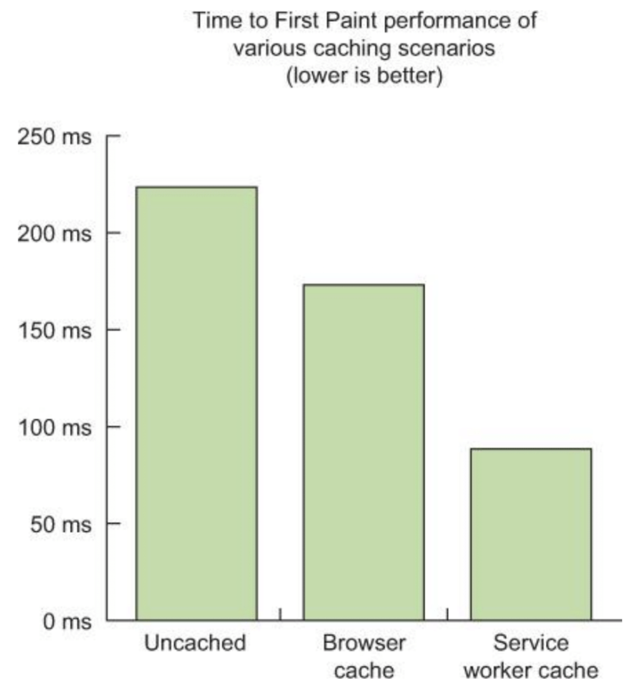
    </td>
  </tr>
</table>

### 9.2.5 Tweaking network request interception behavior
Этом этапе написанный Service Worker всегда берет ресурсы из кэша, что не удобна для часто обновляемых ресурсов, в данном случае это html. Двухсторонний подход заключается в разветвлении обработки ресурсов исходя из условия (в данном случае по наличию в URL ресурса `.html`), одна часть ресурсов берется, как и раньше, из кэша, другая запрашивается по сети.

```
self.addEventListener('fetch', function(ev) {
    var htmlDoc = /(\/|\.html)$/i;
    var deniedAssets = /(sw\.js|sw-install\.js)$/i;

    console.log(ev.request.url);

    if (!deniedAssets.test(ev.request.url)) {
        if (htmlDoc.test(ev.request.url)) {
            ev.respondWith(
                fetch(ev.request).then(function(response) {
                    return response || fetch(ev.request);
                }).catch(function () {
                    return caches.match(ev.request);
                })
            );
        } else {
            ev.respondWith(
                caches.match(ev.request).then(function(response) {
                    return response || fetch(ev.request);
                })
            );
        }
    }
});
``` 
Также можно кэшировать ресурсы с CDN в Service Worker, только нажо проверить чтобы на CDN-сервере был настроен заголовк `Access Control Allow Origin: *`.

### 9.3.1 Versioning your files  
До этого был написан Service Worker, который кэширует ресурсы сайта, такие как CSS, JavaScript и изображения, и всегда извлекает новую копию файлов HTML с сервера.

### 9.3.2 Cleaning up old caches 

```
self.addEventListener('activate', function (ev) {
    var cacheWhitelist = ['v2'];

    ev.waitUntil(
        caches.keys().then(function (keyList) {
            return Promise.all([
                keyList.map(function (key) {
                    if(cacheWhitelist.indexOf(key) === -1) {
                        return caches.delete(key);
                    }

                    return self.clients.claim(); // позволяет Service Worker'ру немедленно начать работу
                })
            ])
        })
    );
});
```

[The  Offline  Cookbook](https://jakearchibald.com/2014/offline-cookbook) - это ресурс для шаблонов, которые можно использовать в своем Service Worker. Некоторые шаблоны ориентированы на производительность, некоторые предпочитают гибкость, поможет, если надо разобраться, с чего начать писать сервисного работника.


# Глава 10 (Fine-tuning asset delivery) 
### 10.1.1 Following compression guidelines  
Настройки для локального сервера (файл в корне `http.js`)
```
var express = require("express"),
	compression = require("compression"),
	path = require("path"),
	app = express(),
	pubDir = "./htdocs";

// Run static server
app.use(compression({
    level: 0
}));
app.use(express.static(path.join(__dirname, pubDir)));
app.listen(8080);

```

`level`(подефолту - 6)- настройка уровня сжатия, в 9 лучше не ставить, ниже график зависимости уровней сжатия и **TTFB (Time To First Byte)** от времени загрузки.

<table cellpadding="0" cellspacing="0" width="100%">
  <tr>
    <td width="500px">
      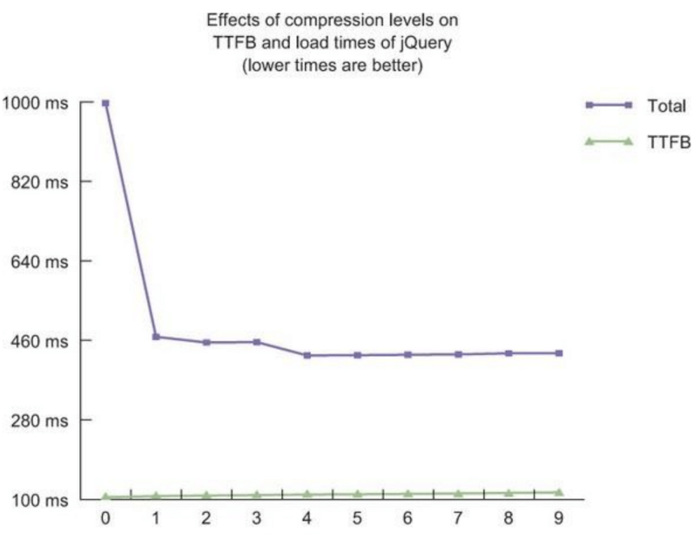
    </td>
  </tr>
</table>

Что хорошо сжимать:
* любые текстовые файлы
* TTF и EOT, хотя они являются бинарными  

Что нужно избегать сжимать - файлы, которые внутренне сжаты:
* большенство типов картинок(кроме SVG)
* шрифты - WOFF, WOFF2

Сжатие внутренне сжатых типов файлов отрицательно сказывается на производительности - нагрузка на процессор, что приводит к снижению **TTFB** для этого ресурса.

### 10.1.2 Using Brotli compression 
Brotli-совместимые браузеры будут сжимать контент только через HTTPS-соединения.

Сжимает **Brotli** от 3% до 10% лучше. Производительность **Brotli** и **gzip** примерно одинакова, пока вы не нажмете на настройки качества 10 и 11 (у Brotli 11 уровней настройки сжатия). Поддержка слабая, но у nginx есть [модуль кодирования Brotli](https://github.com/google/ngx_brotli)   

### 10.2.1 Understanding caching
За поведения кэширования ресурса отвезает заголовок **Cache-Control**

* **no-cache** - говорит браузеру, что любой загруженный ресурс может храниться локально, но браузер должен всегда обновлять ресурс с сервера.

* **no-store** - эта директива указывает, что браузер не должен хранить затронутый актив. Это требует от браузера загрузки любого затронутого актива каждый раз. Это нужно для того, чтобы обезопасить всякую чувствительную информацию.

* **stale-while-revalidate** - указывает, что клиент хочет получить просроченный ответ, одновременно осуществляя фоновую проверку наличия свежих данных. Значение в секундах обозначает, какое время клиент желает получать просроченный ответ.

***Cache-Control and CDNs***
CDN - это прокси-сервер, географически распределённая сетевая инфраструктура, который находится перед вашим сайтом и распространяет контент для пользователей по всему миру. Пользователи отправляют запросы, выполняемые ближайшими к ним серверами.

<table cellpadding="0" cellspacing="0" width="100%">
  <tr>
    <td width="500px">
      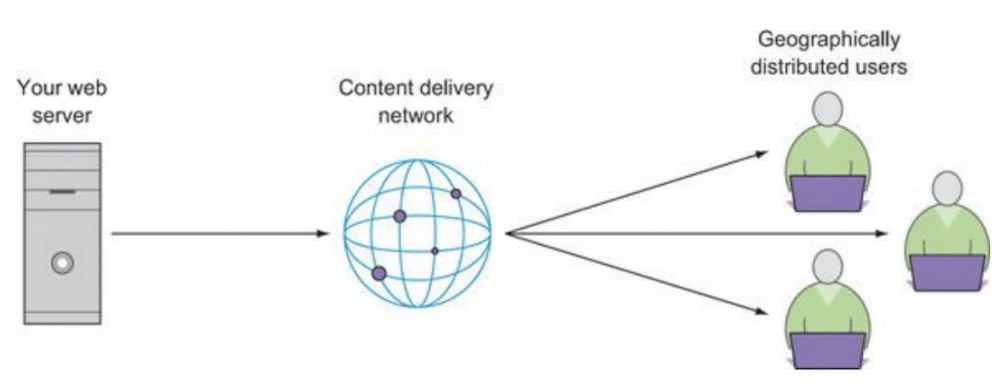
    </td>
  </tr>
</table>

### 10.2.2 Crafting an optimal caching strategy
В книге предлагают такие стратегии кэширования 

| type        | Частота модификации         | Cache-Control  header  value |
| ------------|:---------------------------:|-------------------------------------|
|HTML         |Потенциально часто и должн быть как можно более новый| private,  no-cache,  max-age=3600 |
|CSS и JS     |Потенциально раз в месяц         | public, max-age=2592000, stale-while-revalidate=86400 |
|Images       |Почти никогда       | public, max-age=31536000, stale-while-revalidate=86400 |

Для реализации кэширования на локальном сервере использовали модуль **mime** 

### 10.2.3 Invalidating cached assets
Для обновления ресурсов применяют версионность. Хорошо это реализовать на сервеном языке, например на PHP, функция `file_md5` генерирует хеш **MD5** на основе содержимого файла. Если файл никогда не изменяется, хэш остается неизменным, если изменяется хотя бы один байт файла, изменяется хеш. Можно проверять врямя последнего изменения файла или использовать другие способы атоматизации.

### 10.3.1 Using CDN-hosted assets
Терминология:
**origin-servar** - исходные сервера, от них раздается на пограничные  
**edge-servar** - пограничные серверы, наиболее близкие к пользователю

Цена CDN услуг варьируется от беспланых (подключение поп-библиотек, например https://code.jquery.com/jquery-2.2.3.min.js) до блатных вариантов. 

Любой CDN более эффективен, чем недорогой общий хост.

Преимущества не ограничены скоростью. CDN управляют кэшированием активов, CDN аннулирует ресурсы, когда это необходимо. Если актив CDN, такой как jQuery, широко используется, есть большая вероятность, что в кэше пользователя уже будет этот ресурс. Это снижает время загрузки страницы.

* [cdnjs](https://cdnjs.com) - это CDN, в котором хранится практически любая популярная (и не очень популярная) библиотека. Он обеспечивает чистый интерфейс, который позволяет вам искать любой широко используемый ресурс CSS или JavaScript, например широко используемые структуры MVC / MVVM, плагины jQuery и др.

* [jsDelivr](http://jsdelivr.com) - это еще один CDN, похожий на cdnjs.

* [Google CDN](https://developers.google.com/speed/libraries) гораздо менее полный, чем cdnjs или jsDelivr, но он предоставляет популярные библиотеки, такие как Angular и другие. В книге, на графике был самый быстрый CDN.

* [ASR.NET CDN](http://www.asp.net/ajax/cdn) - среднячок от Microsoft.

Лучше выбрать один CDN и качать с него.

### 10.3.2 What to do if a CDN fails 
Можно прокинуть фоллбэк с помощью JavaScript.

Сразу после скрипта, подключающего ресурс с CDN, написать вызов функции, которая принемает 2 параметра, первый - объект, который должен был загрузиться выше и локальный урл, по которому, в случае неудачи с CDN, загрузиться ресурс: 
```
fallback(window.Modernizr, "js/modernizr.min.js");
```

### 10.3.3 Verifying CDN assets with Subresource Integrity
Используются некие ***Контрольные суммы*** для проверки валидности скачиваемого ресурса с сервера CDN, в некоторых браузерах есть возможность такой валидации прямо через HTML. Если ресурс не валиден, его контрольная сумма CDN не соответствует ожиданиям браузера, то он не загрузится. Такой процесс валидации ресурса, в целях безопастности, называется **Subresource Integrity**. 

Синтаксис для **Subresource Integrity** использует два атрибута для тега <script> или <link>, ссылающегося на ресурс в другом домене. Атрибут `integrity` указывает две вещи: хэш-алгоритм, используемый для генерации ожидаемой контрольной суммы (например, MD5 или SHA-256) и само значение контрольной суммы. Пример:
`integrity="sha256-a47324890+DZA1432948+324fdskFDjfdsA="`

Второй атрибут - `crossorigin`, который всегда имеет значение `anonymou`s для ресурсов CDN, чтобы указать, что для доступа к ресурсу не требуются учетные данные пользователя.

```
<script src="https://code.jquery.com/jquery-2.2.3.min.js"
integrity="sha256-a23g1Nt4dtEYOj7bR+vTu7+T8VP13humZFBJNIYoEJo="
crossorgin="anonymous"
></script>
```

Некоторые CDN предоставляют фрагменты кода, для которых уже настроена функция **Subresource Integrity**, но это еще не стандартная практика. Возможно, придется создавать собственные контрольные суммы, для этого можно воспользоваться генератором контрольной суммы на https://srihash.org.

### 10.4 Using resource hints 
Ресурсные подсказки и директивы (**Resource Hints**) - ускоряют веб-сайты, оптимизируют доставку ресурсов, сокращают количество сетевых задержек, доставляют контент быстрее,— в то время, пока пользователь смотрит страницу.

Выбрала основное из книги + пользовалась [статьей](https://ymatuhin.ru/front-end/html5-link-prefetch/)
 
***Dns-prefetch*** ([support](https://caniuse.com/#search=dns-prefetch)). Помимо DNS устанавливает TCP, TLS связь. Помогает предгрузить соединение для веб сокетов. 
```
<meta http-equiv="x-dns-prefetch-control" content="on">
<link rel="dns-prefetch" href="//ajax.googleapis.com">
```

***Preconnect*** ([support](https://caniuse.com/#search=preconnect)). Перед тем, как начать загружать сожержимое сайта http://example.com, браузеру нужно установить его IP адрес. И только после этого он сможет загрузить от туда содержимое. Конечно, на это потребуется какое-то время. Браузер преобразует имя домена в IP адрес в фоне. Теперь, когда очередь дойдет до ресурсов, они загрузятся минуя стадию prepresolve. Можно указывать в заголовке `rel=preconnect`.
```
<meta http-equiv="x-dns-prefetch-control" content="on">
<link rel="dns-prefetch" href="//ajax.googleapis.com">
```

***Prefetch*** ([support](https://caniuse.com/#search=prefetch)). Указываем браузеру что этот ресурс потребуется нам и браузер загрузит его с низким приоритетом и положит в кэш. Можно использовать для предварительной выборки ресурсов на той же странице, что и запрос, или сделать предположение о том, какие страницы пользователь может посетить далее, и запросить активы с той страницы. Можно указывать в заголовке `rel=prefetch`. 
```
<!-- всю страницу -->
<link rel="prefetch" href="https://ymatuhin.ru">

<!-- только изображение -->
<link rel="prefetch" href="https://ymatuhin.ru/img/yury_matuhin.jpg">
```

Браузер не всегда будет соблюдать **Prefetch**, есть ограничения, например, большие файлы при медленном соединении могут не загрузиться, а Firefox загружает ресурсы только в режиме простоя. В браузерах без поддержки фича игнорируется.

***Subresource*** ([support](https://caniuse.com/#search=subresource)). То-же что и **Prefetch**, только с высоким приоритетом, можно использовать это для критических стилей.

***Preload*** ([support](https://caniuse.com/#search=preload)). Работает так-же как и **Prefetch**, но браузер всегда загрузит ресурс. Можно указывать в заголовке `rel=preload;  as=scrip`. 
```
<link rel="preload" href="https://lololo.ru/jquery-2.2.3.min.js" as="script">
```  
`as` - опционально, можно не указывать 

***Prerender*** ([support](https://caniuse.com/#search=prerender) - поддержка хуже всех). Этот параметр заранее загружает ресурс или страницу и всё её содержимое в фоне. Это как открытие страницы в фоновой вкладке. Браузер загрузит все ресурсы, построит DOM, применит CSS и JS. А когда пользователь перейдет по ссылке, скрытая страница станет заместо текущей и загрузится моментально. Можно указывать в заголовке `rel=prerender`. 
```
<link rel="prerender" href="https://ymatuhin.ru/index.html">
```  


# Глава 11 (Looking to the future with HTTP/2) 

### 11.1.1 Understanding the problem with HTTP/1  

1. **head-of-line blocking** . 

HTTP / 1 не может обрабатывать более 6 запросов одновременно (batch - серия). Запросы отвечают в том порядке, в котором они приняты и новые запросы на контент не могут начать загрузку до тех пор, пока в предшествующему батче не будут завершены.

Первое решение - бандлинг файлов, но из-за это придется тянуть не конкретный изменившийся файл, а весь бандл.  

Второе решение - domain sharding - распределение запросов по доменам(которые, впрочем, могут указывать на один и тот же сервер), это позволяет обходить ограничение браузеров на количество одновременных подключений к одному домену. Например, если подрубить второй домен, то можно одновременно запрашивать не 6 ресурсов, а 12.  

Небольшая оптимизация этого в HTTP/1.1 - [HTTP pipelining](https://ru.wikipedia.org/wiki/HTTP_pipelining), есть и плюсы, и минусы.  

2. **uncompressed headers**  
Когда вы запрашиваете активы с веб-сервера, заголовки сопровождают запрос и ответ от веб-сервера, оони хранят в себе много информаци, иногда избыточной. Сервер сжимает только тело запроса, но не заголовки.  

3. **nonsecure websites**
Серверы с HTTP/1 не обязаны использовать SSL для своих посетителей, это несет проблемы с безопастнотью, не все его подключают :(.

### 11.1.2 Solving common HTTP/1 problems via HTTP/2

1. **head-of-line blocking**  
В отличии HTTP/1 от HTTP/2 использует одно соединение, способное обрабатывать много запросов параллельно.

Кроме книги пользовалась [статьей на хабре](https://habr.com/post/221427/).  

HTTP/2 отправляет фреймы(**Frames**). Существует множество различных фреймов, но все они имеют одинаковое строение: тип, длина, флаги, идентификатор потока и полезная нагрузка фрейма. Существует двенадцать различных типов фреймов в текущем черновике http2 и два, возможно наиболее важных, которые связывают с HTTP/1.1: DATA (данные) и HEADERS (заголовки).

В статье не упоминается, но в книге есть еще Сообщения(**Messages**), которые инкапсулируются потоками. Одно сообщение является грубым эквивалентом запроса HTTP/1 или ответа от сервера.

Идентификатор потока, описывающей формат фреймов, привязывает каждый фрейм, передаваемый поверх http2, к так называемому «потоку»(**Streams**). Поток – это логическая ассоциация. Независимая двухсторонняя последовательность фреймов, которыми обмениваются клиент с сервером внутри http2-соединения. Одно http2-соединение может содержать множество одновременных открытых потоков от любой из сторон, обменивающихся фреймами множества потоков. Потоки могут быть установлены и использованы в одностороннем порядке или совместно использованы как клиентом, так и сервером, и могут быть закрыты любой из сторон. Важен порядок, в котором отправляются фреймы. Получатель обрабатывает фреймы в порядке их получения. Мультиплексирование потоков означает, что пакеты множества потоков смешаны в рамках одного соединения. Два (или больше) отдельных потока данных собираются в один, а затем разделяются на другой стороне. Каждый поток имеет приоритет, используемый для того, чтобы показать другому участнику обмена, какие потоки считать более важными.

<table cellpadding="0" cellspacing="0" width="100%">
  <tr>
    <td width="500px">
      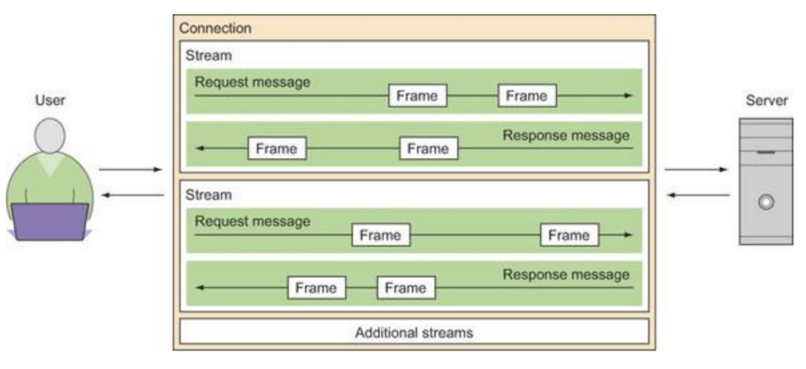
    </td>
  </tr>
</table>

2. **uncompressed headers**  
HTTP/2 устраняет проблему сжатия заголовков, включив алгоритм сжатия **HPACK**. HPACK не только сжимает данные заголовка, но еще удаляет избыточные заголовки, создавая таблицу для хранения дубликатов. Процесс создание таблиц выполняется на стороне клиента при выполнении запросов, а таблица переносится на сервер и разбирается на части для построения ответа.

3. **nonsecure websites**
HTTP/2 использует SSl-соединение, что делает сайт более безопасным. Есть претензия на SSL о том, что оно оказывает влияние на производительность TTFB из-за времени, необходимого для настройки SSL-соединения между сервером и клиентом, но это равносильно нескольким соедениением по HTTP/1 и не проигрывает в производительности, но выигрывает в безопастности.

Бесплатные SSL-сертификаты можно получить через [Let’s Encrypt](https://letsencrypt.org).

### 11.1.4 Observing the benefits
Скорость загрузки сайта увеличивалась на примерах в книге от 7% до 24% в сравнении HTTP/2 и HTTP/1. Скорость осталось одинаковой для страницы с малым количеством ресурсов. 

Количество байт, отправленных на сервер при наличии сжатия заголовков на ~50% меньше. Следовательно время запросы летают быстрее и время на отрисовку первого байта меньше.

### 11.2 Exploring how optimization techniques change for HTTP/2 

* Сжатие ресурсов по прежнему актуалльно (минификация, компрессия, оптимизация изображений).
* Объединение файлов лучше оставить для HTTP/1, поскольку при объединении файлов вы уменьшаете эффективность кэширования при изменении одного из активов в составе. Для HTTP/1 этим жертвуют для получения ресурсов как можно скорее, для HTTP/2 это не нужно, открывается возможность обеспечить лучшее кэширование.

### 11.2.2 Identifying performance antipatterns for HTTP/2 
Собраны антипаттерны оптимизации для HTTP/2 и почему их стоит избегать.

* **Bundling CSS and JavaScript** - то что было описано выше, про политику кэширования.
* **Image sprites** - то что было описано выше, про политику кэширования.
* **Asset inlining** - так же, все инлайн ассеты плохо кэшируются, кэшируются только в контексте документа, в который они встроенны, использование base64 - неэффективно (ниже есть ссылка на декодер), если использовать **Server Push** то инлайновые стили для первого экрана отрисовки не нужны.

### 11.3.1 Understanding Server Push and how it works  

Эта возможность также известна как «посылка в кэш». Идея в том, что если клиент запрашивает ресурс X, а сервер предполагает, что клиент наверняка затем попросит ресурс Z, отправляет этот ресурс клиенту без просьбы с его стороны. Это помогает клиенту поместить Z в свой кэш, и он будет на месте, когда потребуется. **Server Push** – это то, что клиент явно должен разрешить серверу, и даже если он разрешил, он может по своему выбору быстро отменить посланный поток с помощью RST_STREAM, если он ему оказался не нужен.

Более наглядный пример: пользователь переходит на сайт, запрашивает у сервера html, на сервере настроен PUSH, отдает html вместе в фалом стилей, это уменьшает время, необходимое пользователю для ожидания загрузки стилей, поскольку серверу не нужно ждать, пока клиент запросит `styles.min.css`. 

<table cellpadding="0" cellspacing="0" width="100%">
  <tr>
    <td width="500px">
      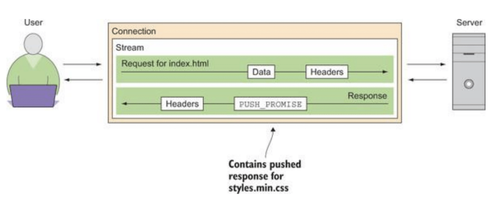
    </td>
  </tr>
</table>

Нет ограничений на количество активов на один запрос.

### 11.3.2 Using Server Push

Server Push вызывается на серверах путем настройки заголовка ответа HTTP, когда запрашивается конкретный актив: 
```
Link: </css/styles.min.css>; rel=preload;  as=style
```
Это похоже на **resource hint**, но если просто прописать подсказку в тэге `<link>` это не сработает, нужны именно заголовки. `as` - необязательный атрибут (полный список его значений можно найти [здесь](https://www.w3.org/TR/preload/#link-element-interface-extensions)). 

Убедиться в том, что ресурс получен из **Push** можно с помощью столбца **Initiator** в Network панели хрома.
Есть еще [консольная утилита](https://nghttp2.org/documentation/nghttp.1.html).

### 11.3.3 Measuring Server Push performance

<table cellpadding="0" cellspacing="0" width="100%">
  <tr>
    <td width="500px">
      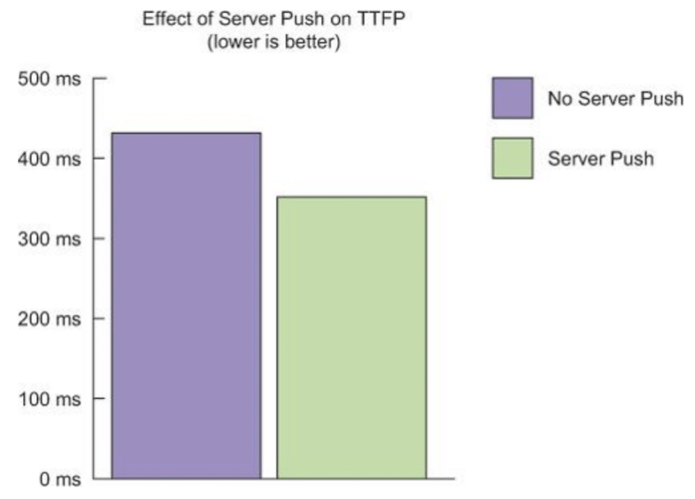
    </td>
  </tr>
</table>

Рекомендации по использованию **Server Push**:
* Можно одновремменно пушить несколько ресурсов  
* Можно пушнуть ресурс, которые не нужен на текущей странице, но ожидаем на следующей, на которую перейдет пользователь

### 11.4.1 How HTTP/2 servers deal with HTTP/2-incapable browsers
Под капотом каждого браузера с поддержкой HTTP/2, есть поддержка HTTP/1. Коммуникация начинается с HTTP/2, если клиент-сайд не умеет в HTTP/2 соединение понижается до HTTP/1. 

### 11.4.3 Serving assets according to browser capability
Далее в книге рассказывают как определить версии протакола и для node-сервера обработать данные в зависимости от версии 

пакеты **jsdom**, **spdy** или использовать возможности других серверов, например в php-серверах есть переменная  `$_SERVER["SERVER_PROTOCOL"]` 


# Глава 12 (Automating optimization with gulp)

Содержит общие сведения о gulp и о популярных тасках для оптимизации ресурсов и процессов автоматизации повседневных задач фронтэндера, в целом достаточно ознакомиться со [скринкастом про Gulp](http://learn.javascript.ru/screencast/gulp)

Какие плагины советуют в книге 

Общие
`npm i -g gulp-cli gulp`

Основные 
`npm install gulp-util del gulp-livereload gulp-ext-replace`

HTML-минификатор
`npm install gulp-htmlmin`

Для CSS
`npm install gulp-less gulp-postcss autoprefixer autorem cssnano`

Для JS
`npm install gulp-uglify gulp-concat`

Для изображений
`npm install gulp-imagemin imagemin-webp imagemin-jpeg-recompress imagemin-pngquant imagemin-gifsicle imagemin-svgo`


# Best Practices 
### 1. Использовать `rel="noopener"`
Если у ссылки есть `target="_blank"` то нужно прописать ей `rel="noopener"`, для этого есть пара причин, первое - безопасность, если это ссылка на внешний ресурс, то внешний ресурс будет иметь возможность доступа к `window.opener`, второе - 
производительность, окна, запущенные через `target="_blank"` работают в одном процессе и потоке `rel="noopener"` предотвращает работу `window.opener` и кроссдоменный доступ. Основанные на Chromium браузеры создают для новых страниц собственные процессы.  
### 2. Флексы - наше всё (пока не пришли гриды)
Использовать `flexbox` где возможно вместо `float`, тесты производительности [показывают](https://developers.google.com/web/fundamentals/performance/rendering/avoid-large-complex-layouts-and-layout-thrashing#flexbox) лучший результат в пользу первого.  

### 3. BEM
Снижать сложность селекторов - использовать BEM.

### 4. 60fps = just 16ms
Поскольку в секунду существует 60 FPS и 1000 миллисекунд, простая математика определяет бюджет 16,66 мс на фрейм. Google рекомендует 10ms на фрейм. До показа анимации дается 100ms на ее расчет.

### 5. Изменение стилей через JS
Если надо поменять стиль у элемента в JS (через свойство или навесить класс), то надо делать это у конкретного элемента, а не у родителя, даже когда у вас есть несколько элементов для изменения под одним родителем

### 6. Layout Thrashing (cначала чтение, потом записи в ДОМ)

Код ниже плох тем, что в цикле происходит чтение и сразу же запись стилей (что вызывает перерисовку макета) и чтение уже становиться недействительными, поскольку часть дерева рендеринга изменилась.
```
for (var p = 0; p < paragraphs.length; p++) { 
    var para = paragraphs[p];
    var width = div.offsetWidth;
    para.style.left = width + 'px';
}
```

Меняем код: 
```
var width = div.offsetWidth; 
for (var p = 0; p < paragraphs.length; p++) { 
    var para = paragraphs[p]; 
    para.style.left = width + 'px'; 
}
```
Now it’s read-write-write-write. 

### 7. Границы слоя
У блоков в дереве DOM можно выделить слои, за которые перересовка дерева не выйдет (в табе **Rendering** можно включить показ границ слоев), чтобы создать у элемента искуственные границы можено воспользоваться свойствами `translateZ(0) or backface-visibility: hidden` . Подробнее [раздел 4. Paint Storms](https://calendar.perfplanet.com/2013/the-runtime-performance-checklist/)

### 8. viewport
```
<meta name="viewport" content="width=device-width, initial-scale=1, maximum-scale=1, user-scalable=no">
```
`width=device-width` - сообщает браузеру, что нужна область просмотра контента, равная ширине экрана мобильного устройства.

### 9. Для всех изображений `max-width: 100%;`

# Полезные ссылки 
* [документатция от Гугла по Chrome DevTools](https://developers.google.com/web/fundamentals/performance/why-performance-matters/)

# Инструменты 
### 1. [Google PageSpeed Insight](https://developers.google.com/speed/pagespeed/insights/)  
Чтобы лучше понять этот инструмент и его параметры есть хорошая [статья](https://medium.com/web-standards/performance-metrics-ff23c213164e), вкратце:  
Точки (события) для измерения производительности:  
* `DOMContentLoaded` - срабатывает, когда браузер полностью загрузил HTML и построил DOM-дерево, но при этом, возможно, ещё не догрузились какие-то картинки или стили.  
* `load` - срабатывает, когда страница полностью загрузилась и пользователь может полностью с ней взаимодействовать.  

**Прогрессивные веб-метрики**
или **ПВМ** - список метрик, отвечающий на вопросы пользователя открывшего страницу:  


1. Что происходит?* Произошла ли навигация успешно;
2. Это то, что мне нужно? Отрендерилась ли страница, достаточно ли там контента, с которым можно взаимодействовать;
3. Уже можно пользоваться? Можно ли, наконец, взаимодействовать со страницей или она всё ещё занята;
4. Это восхитительно? Испытывал ли пользователь негативный опыт зависания скролла, анимация, медленных шрифтов.

* First Paint (FP) - Первая отрисовка - событие первой отрисовки срабатывает, когда только начался отрисовываться графический слой, но не картинки, SVG или Canvas.  
* First Contentful Paint (FCP) - Первая отрисовка контента - это время, когда пользователь видит что-то полезное, отрисованное на странице. То, что отличается от пустой страницы. _**Это ответ на первый вопрос**_. Разница между первой отрисовкой и первой отрисовкой контента может занимать от миллисекунд до секунд. Если первая отрисовка контента занимает очень много времени то возможно, есть проблемы на уровне соединения, ресурсы (например, сама HTML-страница) очень тяжелые и чтобы их доставить нужно время.
* First Meaningful Paint (FMP) - Первая значимая отрисовка - весь главный контент(шапка и текст блога, содержимое для поисковиков, критичные для интернет-магазинов картинки) появился на странице. _**Это ответ на второй вопрос**_. Если главный контент не был отрисован долгое время, значит очень много ресурсов (картинки, стили, шрифты, скрипты) имеют высокий приоритет загрузки и в результате блокируют первую значимую отрисовку.  
* Visually Ready - Визуально готов - страничка выглядит «почти» загруженной, но браузер еще не закончил выполнять скрипты.  
* Estimated Input Latency - Задержка ввода - определяет как плавно приложение реагирует на ввод пользователя. Если главный поток занят обработкой каждой длинной задачи, то станет заметно замедление реакции на ввод.  
* First Interactive - Первое взаимодействие - считается случившимся если произошла первая значимая отрисовка, сработал DOMContentLoaded, страница визуально готова на 85%. _**Это ответ на третий вопрос**_.  
* Visually Complete - Визуально готово - финальная точка, когда мы можем сказать, доволен пользователь процессом загрузки или нет. _**Это ответ на четвертый вопрос**_.

### 2. Rendering tab
Включить - открыть панель разработчика, далее `Cmd+Shift+P`, вводим `Show Rendering` - появится таба **Rendering**, на ней:  
* **Paint Flashing** - всякий раз, когда часть страницы перерисовывается, DevTools выделяет этот раздел зеленым цветом.

### 3. Плагин [Lighthouse](https://chrome.google.com/webstore/detail/lighthouse/blipmdconlkpinefehnmjammfjpmpbjk)
таба **Audits** доступна в Chrome DevTools

### 4. [Speed Scorecard](https://www.thinkwithgoogle.com/feature/mobile/)
Новый инструмент от Google, который позволяет сравнивать скорость загрузки мобильного сайта с другими интернет-ресурсами. Speed Scorecard отображает скорость загрузки тысяч мобильных сайтов из 12 стран по всему миру (России пока нет).  

### 5. [Pingdom](https://tools.pingdom.com)
Онлайн ресурс с подробной статистикой по странице, сразу видно сколько она весит, сколько грузится, все запросы, хороший и удобный ресурс, но слишком частые проверки приводят к сокращению времени загрузки, вероятно из-за кеширования + иногда приходится постоять в очереди  

### 6. Оптимизация видео 
```
brew install ffmpeg
```

`ffmpeg -i input.mp4 -movflags faststart -acodec copy -vcodec copy output.mp4` - [подробнее](http://denis-zavgorodny.github.io/2017/01/30/mp4-web-optimizing/), [утилита](https://www.ffmpeg.org/)

### 7. [base64encode.org](https://www.base64encode.org/)
